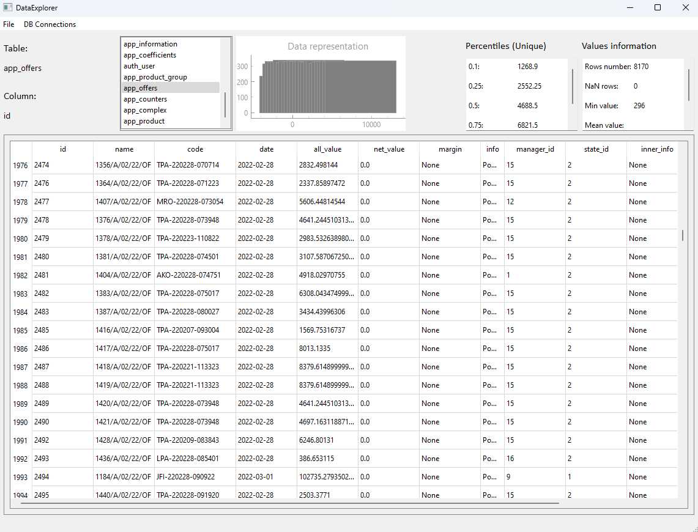

## PyQt Data Explorer

## Introduction
This application is developed using Python with the PyQt framework. 
It provides an interface for opening and interacting with various types of data storage and formats, such as CSV files, XLSX files, and SQLite and PostgreSQL databases.
Beyond reading and analyzing data you can save data from file to database and vice versa.
#### Tip:
Clickable elements are: menu, list with tables name, table header (columns name)

## Features
### Data Import
The application allows users to open and read data from CSV and XLSX files, as well as from SQLite and PostgreSQL databases.

### Data Viewing and Analysis
In the edit mode, users can choose a table and browse its data.

If the data is numerical, the application presents a histogram and percentile calculations. Additionally, it provides a list comprising the total number of rows, the number of empty or NaN rows, and statistics such as minimum, maximum, and mean values.

If the data is non-numerical, the application simply displays the total number of rows and the number of empty rows. Instead of percentiles, it presents information about unique values in the dataset.

### Data Export
Beyond reading and analyzing data, the application also offers the functionality to save the data back to CSV and XLSX files, or to SQLite and PostgreSQL databases.